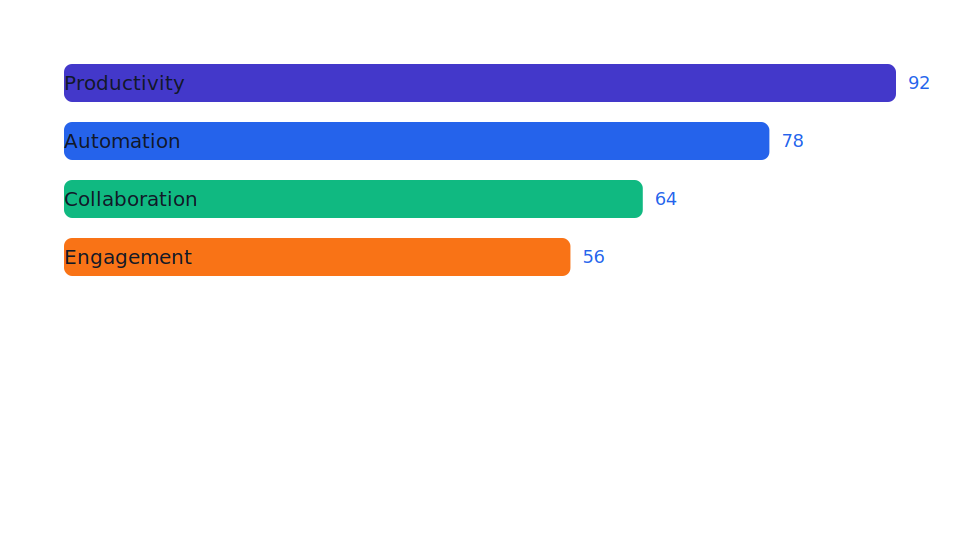
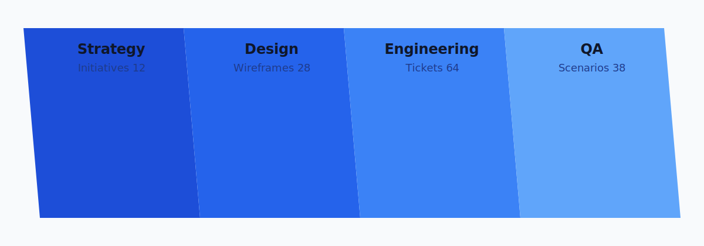
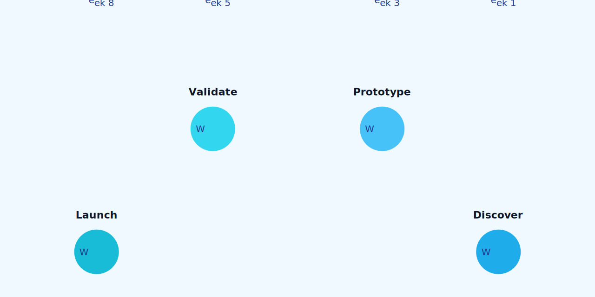
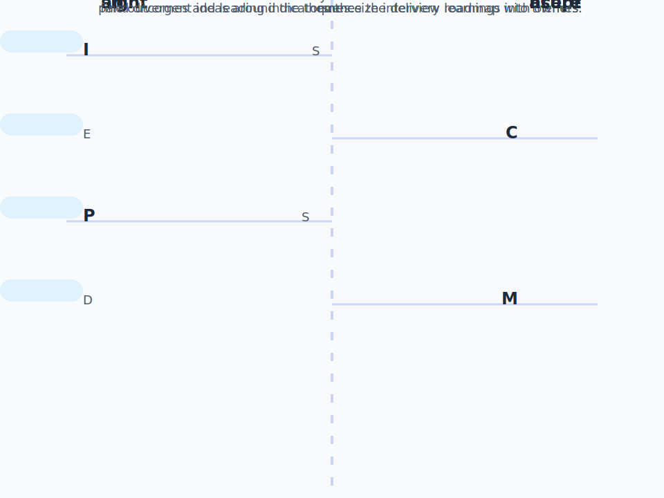
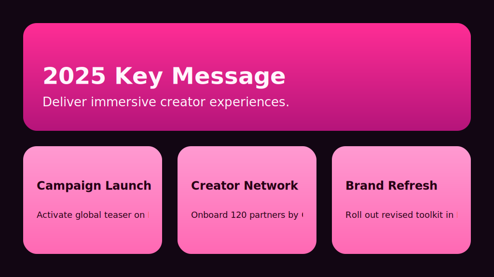

# Infogroove

Infogroove converts declarative template definitions into SVG infographics using
[sympy](https://www.sympy.org/) for formula evaluation and
[svg.py](https://pypi.org/project/svg.py/) for SVG generation.

## Quick Start

Create the virtual environment and install dependencies with uv:

```bash
uv sync
```

Render any of the bundled examples (each lives in its own subdirectory):

```bash
uv run infogroove -f examples/horizontal-bars/def.json -i examples/horizontal-bars/data.json -o examples/horizontal-bars/horizontal-bars.svg
uv run infogroove -f examples/stat-cards/def.json -i examples/stat-cards/data.json -o examples/stat-cards/stat-cards.svg
uv run infogroove -f examples/blue-parallelograms/def.json -i examples/blue-parallelograms/data.json -o examples/blue-parallelograms/blue-parallelograms.svg
uv run infogroove -f examples/arc-circles/def.json -i examples/arc-circles/data.json -o examples/arc-circles/arc-circles.svg
uv run infogroove -f examples/staggered-keywords/def.json -i examples/staggered-keywords/data.json -o examples/staggered-keywords/staggered-keywords.svg
```

## Running Tests

Install development dependencies and execute the test suite with pytest:

```bash
uv sync --extra dev
uv run --extra dev pytest
```

To measure coverage locally you can add the ``--cov`` flag:

```bash
uv run --extra dev pytest --cov=infogroove --cov=tests
```

## Example Gallery

| Template | Preview |
| --- | --- |
| Horizontal Bars |  |
| Stat Cards |  |
| Blue Parallelogram Bands |  |
| Arc Circles |  |
| Staggered Keywords |  |
| Key Messages |  |

## Template Overview

A template definition is a JSON document with these top-level keys. The design
aims to keep templates declarative and predictable:

- **Explicit scopes.** Global `let` bindings establish shared context, while
  `repeat.let` creates isolated, per-loop overlays. Values never bleed across
  scope boundaries unless you intentionally rebind them.
- **Deterministic evaluation.** Bindings resolve lazily the first time they
  are referenced. Cycles are detected and reported early, preventing runaway
  recursion and making intent obvious.
- **Composable building blocks.** Elements remain small, nested structures.
  Complex layouts emerge from combining scoped bindings and child trees rather
  than inventing a verbose DSL.

- `let`: Global bindings evaluated before rendering begins. Provide the
  `canvas` size here (`width`, `height`) along with reusable constants such as
  `palette`, `margin`, or `fontFamily`. Bindings can be literals or
  expressions; results become available directly as `{margin}` (and are also
  exposed under `let.margin` for compatibility).
- `template`: A list of element descriptors. Each descriptor has a `type`,
  optional attribute map, optional `text`, and optional `children`. Elements
  render once unless a `repeat` block is present.
- `numElementsRange` (optional): Expected minimum and maximum number of input
  records for validation.

The `repeat` block explicitly controls iteration:

```json
{
  "type": "text",
  "repeat": {
    "items": "items",
    "as": "row",
    "index": "idx",
    "let": {
      "label": "row.label",
      "x": "idx * 24"
    }
  },
  "attributes": {"x": "{x}", "y": "40"},
  "text": "{label}"
}
```

- `items` references the collection to iterate (any dotted path resolved via
  `let`/data access).
- `as` names the current element, while the optional `index` binding exposes
  the zero-based position.
- `let` injects per-iteration bindings scoped to that repeat. Expressions can
  reference the current item, previously declared loop bindings, and globals.

During iteration, Infogroove also injects reserved helpers such as `__index__`,
`__first__`, `__last__`, `__count__`, and `__total__` for convenience.

Placeholder syntax supports both `{path.to.value}` lookups and inline Python
expressions such as `{idx * 10}` or `{canvas.width / 2}`. Expressions are
evaluated inside the same safe context as loop bindings (global let values,
data fields, derived metrics, and loop-scoped bindings).

## CLI Options

```
uv run infogroove --help
```

Key flags:

- `-f, --template`: Path to the template definition JSON file (e.g. `def.json`).
- `-i, --input`: JSON file containing an array of data objects.
- `-o, --output`: Destination SVG path or `-` for stdout.

## Programmatic Usage

Infogroove exposes a loader for integrating templates directly into Python
applications:

```python
from infogroove.loader import load

with open("examples/arc-circles/def.json", encoding="utf-8") as fh:
    infographic = load(fh)

data = [{"label": "Alpha", "value": 3}]
svg_markup = infographic.render(data)
```

Prefer `infogroove.loader.load` for file objects and `infogroove.loader.loads`
when the template definition is already in memory as a string. Both helpers
return an `InfogrooveRenderer`, exposing the parsed template via the
`template` property for metadata inspection.

When you already have the JSON structure as a Python mapping, instantiate an
infographic directly with the `Infogroove` factory:

```python
from infogroove import Infogroove

infographic = Infogroove({
    "let": {
        "canvas": {"width": 200, "height": 40},
        "gap": 10,
    },
    "template": [
        {
            "type": "circle",
            "attributes": {"cx": "{idx * gap}", "cy": "20", "r": "5"},
            "repeat": {"items": "data", "as": "item", "index": "idx"}
        }
    ],
})

svg_inline = infographic.render([{}] * 10)
```

## Developing Templates

- Keep shared constants (including canvas dimensions) under the top-level
  `let` block.
- Use `repeat` to make iteration explicit; push derived per-loop values into
  its `let` bindings so they stay scoped to that block.
- Inline expressions handle quick maths (`{idx * 10}`) while `repeat.let`
  bindings are ideal for shared or multi-step calculations.
- Let bindings resolve lazily, so the order you declare keys does not matter.
  However, circular definitions (e.g. `total: "max"`, `max: "total"`) will be
  rejected with a clear error. Break cycles by lifting shared calculations into
  a new binding or restructuring the dependency chain.
