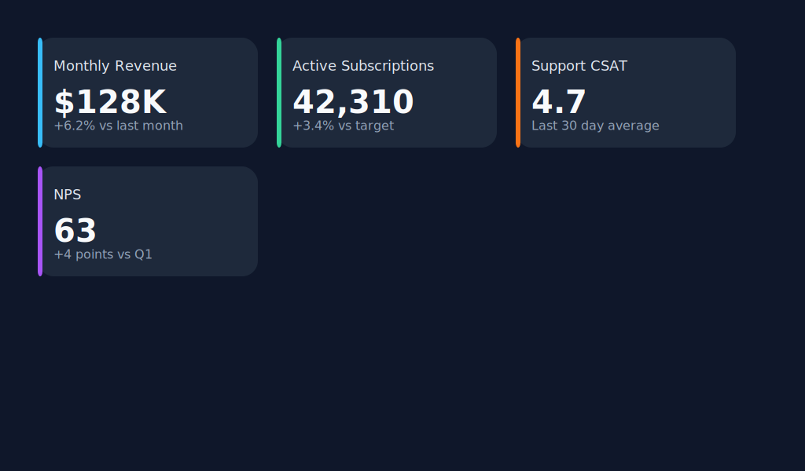

# Infogroove

Infogroove converts declarative IGD templates into SVG infographics using
[sympy](https://www.sympy.org/) for formula evaluation and
[svg.py](https://pypi.org/project/svg.py/) for SVG generation.

## Quick Start

Create the virtual environment and install dependencies with uv:

```bash
uv sync
```

Render any of the bundled examples (each lives in its own subdirectory):

```bash
uv run infogroove -f examples/horizontal-bars/horizontal-bars.igd -i examples/horizontal-bars/horizontal-bars.json -o examples/horizontal-bars/horizontal-bars.svg
uv run infogroove -f examples/stat-cards/stat-cards.igd -i examples/stat-cards/stat-cards.json -o examples/stat-cards/stat-cards.svg
uv run infogroove -f examples/blue-parallelograms/blue-parallelograms.igd -i examples/blue-parallelograms/blue-parallelograms.json -o examples/blue-parallelograms/blue-parallelograms.svg
uv run infogroove -f examples/arc-circles/arc-circles.igd -i examples/arc-circles/arc-circles.json -o examples/arc-circles/arc-circles.svg
uv run infogroove -f examples/staggered-keywords/staggered-keywords.igd -i examples/staggered-keywords/staggered-keywords.json -o examples/staggered-keywords/staggered-keywords.svg
```

## Running Tests

Install development dependencies and execute the test suite with pytest:

```bash
uv sync --extra dev
uv run --extra dev pytest
```

To measure coverage locally you can add the ``--cov`` flag:

```bash
uv run --extra dev pytest --cov=infogroove --cov=tests
```

## Example Gallery

| Template | Preview |
| --- | --- |
| Horizontal Bars |  |
| Stat Cards |  |
| Blue Parallelogram Bands |  |
| Arc Circles |  |
| Staggered Keywords |  |

## Template Overview

An IGD template is a JSON document with these top-level keys:

- `screen`: Width and height of the SVG viewport in pixels.
- `styles`: Arbitrary constants reused across elements.
- `formulas`: Named expressions evaluated with sympy. Results are merged into
  the rendering context for placeholder substitution.
- `elements`: A list of SVG element descriptors. Each descriptor has a `type`,
  attribute map, optional `text` content, and an optional `scope` (`canvas` or
  `item`). Canvas elements are rendered once; item elements repeat for each
  data record.
- `numElementsRange` (optional): Expected minimum and maximum number of data
  items.

Placeholder syntax uses `{path.to.value}` lookups resolved against the current
context (styles, data fields, and formula results).

## CLI Options

```
uv run infogroove --help
```

Key flags:

- `-f, --template`: Path to the `.igd` template.
- `-i, --input`: JSON file containing an array of data objects.
- `-o, --output`: Destination SVG path or `-` for stdout.

## Developing Templates

- Formulas can reference global values (`screenWidth`, `styles.margin`),
  per-item fields (`value`, `label`), and derived metrics (`maxValue`,
  `averageValue`).
- Use the `styles` section for reusable constants and color palettes.
- Provide `scope: "canvas"` for static backgrounds and decorations.
- Keep attribute expressions simple; if you need math, create a formula and use
  its placeholder in the attribute map.
